# TenderStudio

**Intelligent Procurement & Tender Management for Sri Lankan Public Sector**

TenderStudio is a web-based system that digitises the complete tender evaluation lifecycle — from initial creation through contract award and post-award tracking — in strict compliance with the **National Procurement Manual 2024** of Sri Lanka.

---

## The Story

Every public-sector procurement in Sri Lanka runs through a committee. A Bid Evaluation Committee (BEC) — typically three to five officers — sits in a room with printed quotations, a projector, and an Excel workbook. They go row by row through a requirements grid: one row per specification, one column per bidder. They record Accept or Reject in each cell, add notes in the margins, and at the end of several long sessions, the Secretary manually transcribes everything into a Word document — the BEC Evaluation Report. That report can run to 60+ pages across 14 sections and 20 tables.

The process works. It has legal weight, it is auditable, and the committees take it seriously. But it is painfully slow, prone to transcription errors, and leaves no machine-readable record of *why* a decision was made.

I spent time reading through a real completed tender (PR 211-1: Laboratory Equipment for SLIBTEC) — the tender document, the finished evaluation report, and the actual Excel workbook used during evaluation. 5 items. 11 bidders. Up to 42 requirements per item. Hundreds of individual cell decisions, all manually recorded and then re-typed into the report.

TenderStudio started as an answer to one question: **what if the evaluation grid was the source of truth, and the report wrote itself?**

It grew from there. The clarification system. The AI-assisted evidence extraction. The forensic audit trail. The session controls built around how committees actually work — physically together, one screen, one Secretary driving. Every design decision traces back to something observed in that real tender.

The system is currently in the **specification phase** — a detailed functional specification (v5.1) has been written covering all 18 lifecycle stages, the complete data model, AI feature design, compliance rules, and UI specifications. No production code has been written yet. The wireframes and UI designs shown below represent the planned interface.

---

## What It Does

TenderStudio covers the **complete tender lifecycle** across 18 stages:

> Creation → DPC Budget Approval → Bid Document Prep → Publication → Pre-Bid Meeting → Bid Opening → BEC Assignment → BEC Evaluation → Clarifications → Report Generation → BEC Certification → PM Review → DPC Final Approval → Award → Post-Award Tracking → Archive

Key capabilities:

- **Structured evaluation grid** — requirements in rows, bidders in columns, per-item view optimised for projector display during committee sessions
- **AI-assisted evidence extraction** — RAG over OCR'd bidder documents auto-populates offered values, document references, and extracted text; humans verify and decide
- **Automated report generation** — all 14 report sections and 20 tables generated directly from evaluation data; AI drafts narratives, humans edit
- **Clarification management** — two-level thread system (requirement-level and item-level), with bidder and requestor threads tracked separately through full approval workflow
- **Forensic audit trail** — every state change timestamped, attributed, and immutable; exportable for auditors
- **Full offline support** — all evaluation work possible offline; automatic sync on reconnection
- **Local AI processing** — all models run on the backend server; no procurement data leaves the organisation's infrastructure

---

## Who Uses It

| Role | What They Do |
|---|---|
| **Procurement Manager (PM)** | Creates tenders, assigns committees, monitors progress (read-only for BEC work), sends clarifications, tracks post-award delivery |
| **BEC Chair** | Leads evaluation sessions, approves clarifications, controls price visibility, certifies the final report |
| **BEC Secretary** | Operates the software during sessions, records decisions, drafts clarifications |
| **BEC Member** | Reviews evidence, enters decisions, adds evaluator notes |
| **BOC Members** | Witness bid opening, record bidder totals, verify bid security |
| **DPC Members** | Budget approval at start, final approval before award |
| **System Administrator** | Manages users, maintains BEC eligibility pool, configures settings — cannot participate in any tender |

**Critical rule**: Procurement Department staff can never be BEC members. The system enforces this absolutely.

---

## UI Screens

### Procurement Dashboard
The PM's command centre — live tender pipeline, action queues, upcoming deadlines, and financials at a glance.

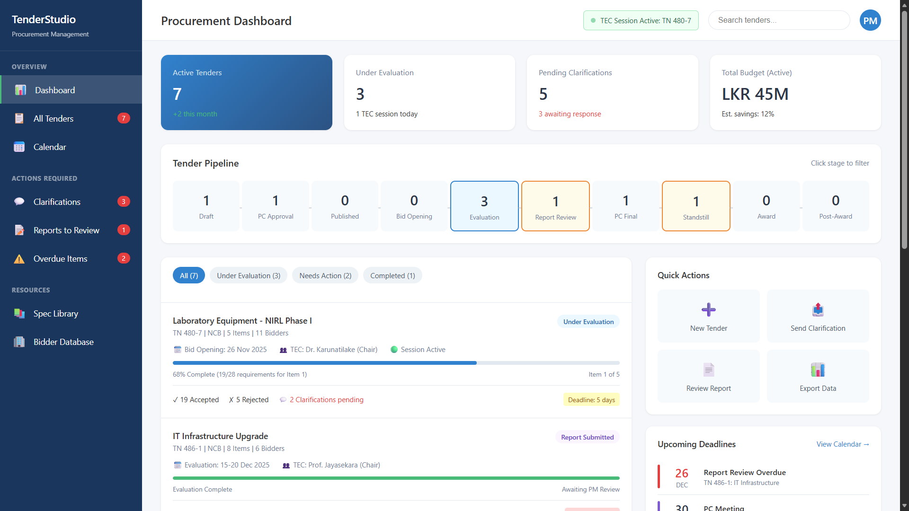

---

### Tender Creation
Step-by-step wizard with real-time compliance guidance. Procurement method, contract type, PC type, and COI rules are enforced at input — not discovered later.

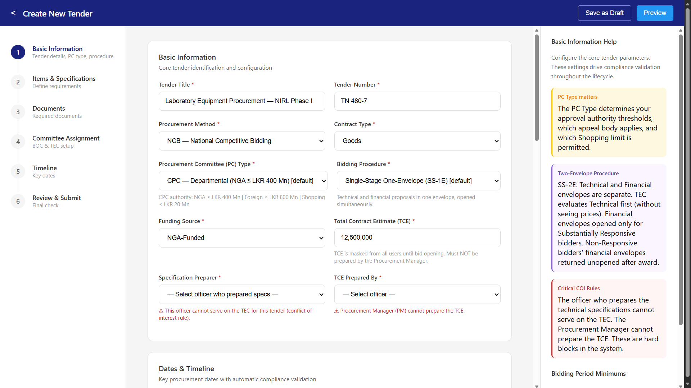

---

### Pre-Bid Meeting
Manages document purchaser registry, attendance, Q&A recording, and addendum issuance — all linked back to the tender record.

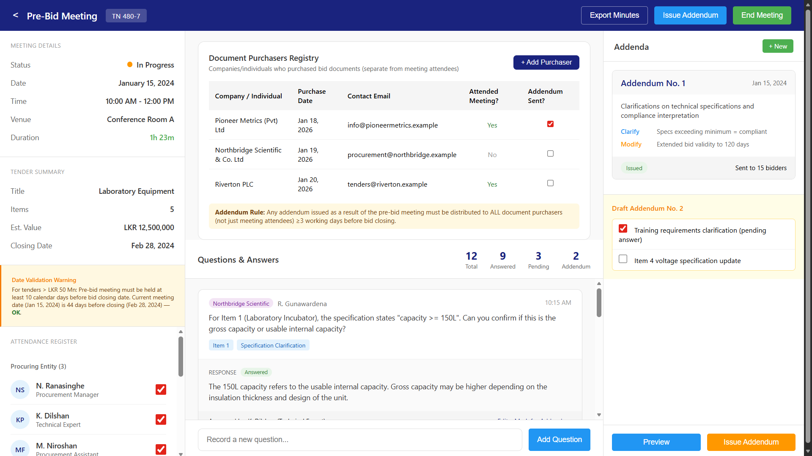

---

### Specification Library
Reusable specifications organised by category. Import into any tender; mark requirements as Compulsory or Optional. Shared across the organisation.

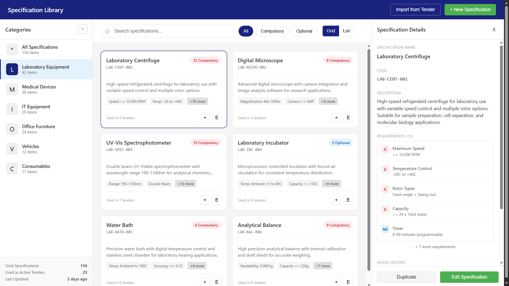

---

### User Management & BEC Eligibility Pool
Full user administration with role assignment, department tracking, and a maintained pool of BEC-eligible officers available for committee assignment.

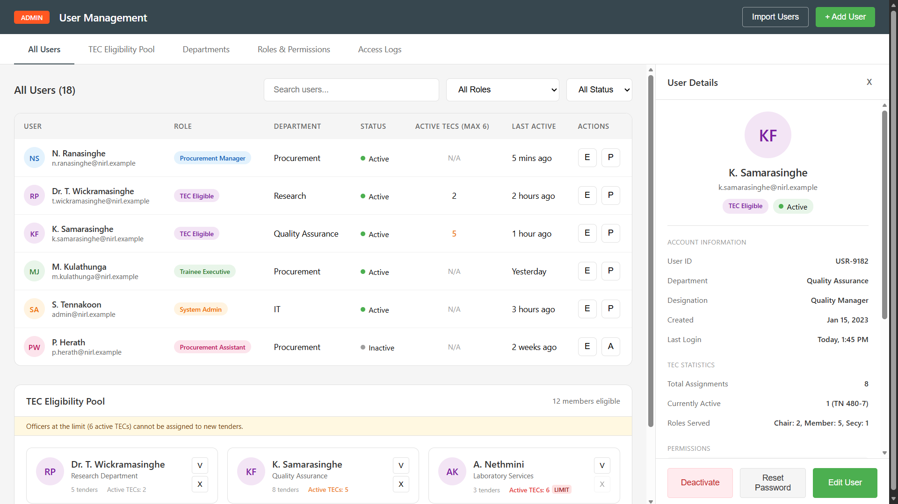

---

### Bid Opening Ceremony
Live session with timer, BOC attendance, bid recording (read-aloud totals, bid security verification), and withdrawal/modification handling — all logged in real time.

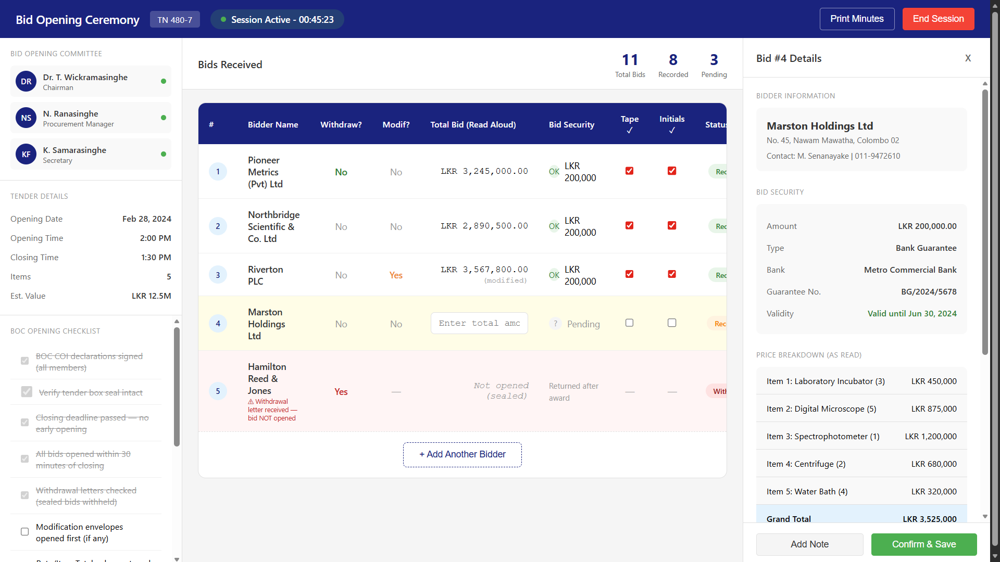

---

### Bidder Compliance Overview
Per-bidder view across all items — compliance status, bid summary, document checklist, and per-requirement decisions. Drill down from any item.

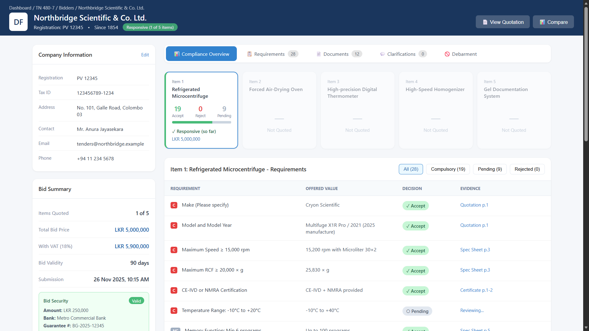

---

### Evaluation Grid
The core of TenderStudio. Full-screen grid optimised for projector display. AI auto-populates evidence fields from bidder documents; the BEC verifies and decides. Color-coded: green (Accept), red (Reject), gray (Pending), orange border (clarification active). Maker-Checker verification enforced on all AI extractions.

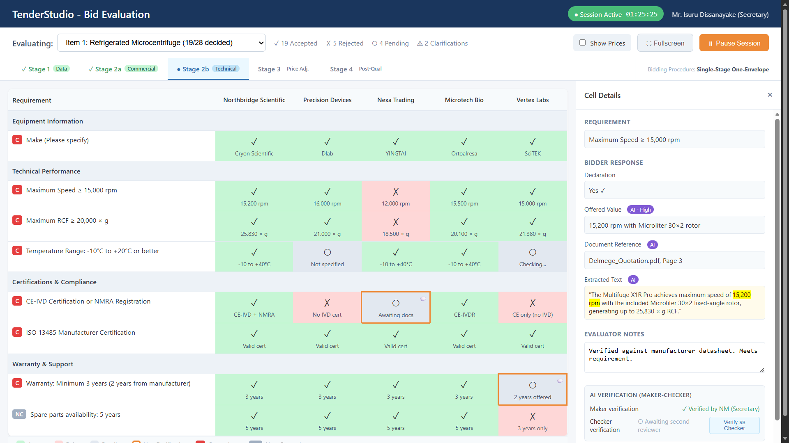

---

### Report Preview & Generation
Live report preview with section-by-section completion tracking, AI narrative drafts, validation warnings, and one-click export to Word (.docx) or PDF. Tables are auto-generated from evaluation data — no transcription.

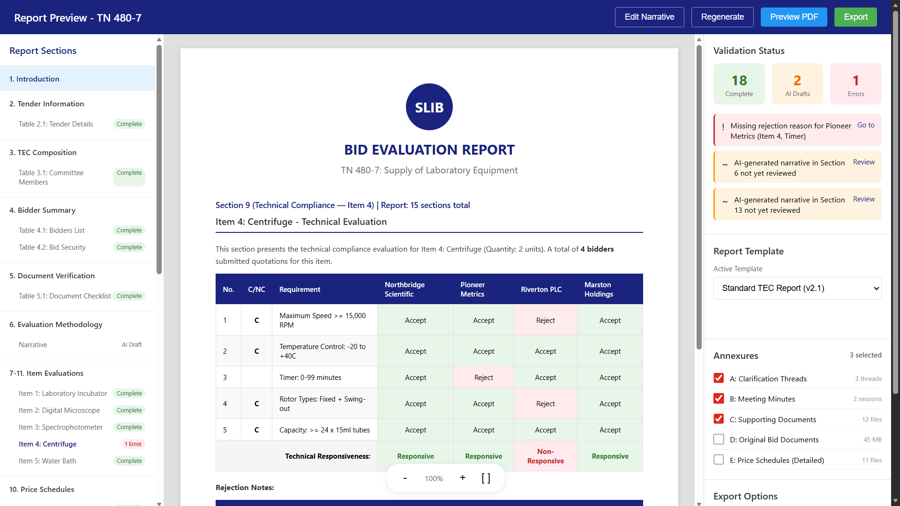

---

### Clarification Management
Two-level thread system: requirement-level (tied to a specific cell) and item-level (general queries). Full approval workflow: Secretary drafts → Chair approves → PM sends → PM enters response → BEC reviews. Thread closure requires Satisfied / Not Satisfied.

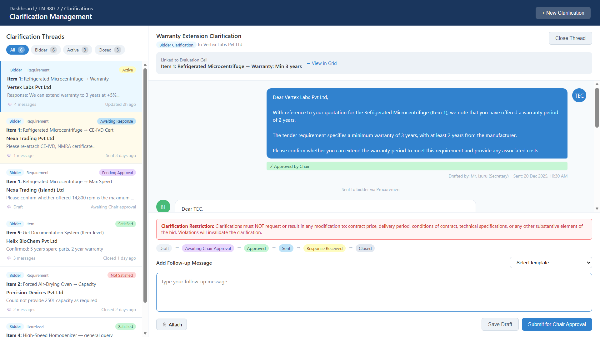

---

### Audit Trail
Immutable, forensic-grade log of every action — evaluation decisions, session events, COI declarations, clarification responses, access events. Filterable by tender, user, date range, and action type. Exportable to CSV.

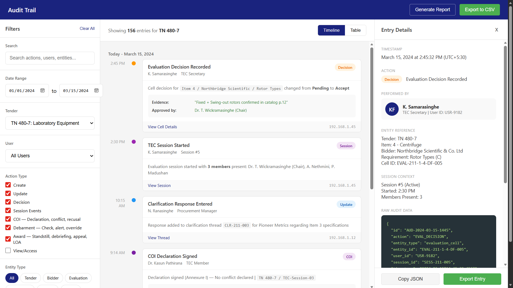

---

### Post-Award Tracking
Tracks delivery, installation, and commissioning milestones per item. Performance security monitoring, contract variation requests with approval thresholds, and supplier-level progress rollup.

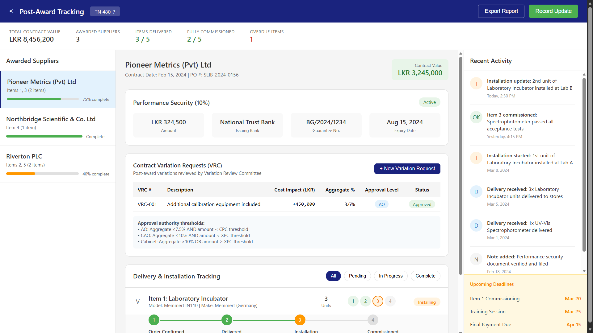

---

## Design Principles

1. **Assist, not decide.** Every AI output is a draft for human review. No AI action is final without human confirmation.
2. **Strict role separation.** Procurement staff cannot be BEC members. The system enforces this at every entry point.
3. **Session-based collaboration.** BEC evaluations happen in physical meetings with the Secretary operating the software on a shared screen.
4. **Forensic audit trail.** Every state change is timestamped, attributed, and immutable. Nothing is deleted.
5. **Offline-first.** All evaluation work is possible without network; sync happens automatically on reconnection.
6. **Legal compliance.** Every enforcement rule traces to the National Procurement Manual 2024.

---

## Legal Framework

TenderStudio operates under the **National Procurement Manual 2024** issued by the National Procurement Commission of Sri Lanka. It applies to:

- Ministries and Government Departments
- Public Corporations and Statutory Bodies
- Local Authorities
- Government Business Undertakings
- Government-owned Companies (>50% government shareholding)

Scope: **Goods**, **Works**, and **Non-Consulting Services**. Consulting Services are out of scope.

---

## Project Status

| Area | Status |
|---|---|
| System Specification (v5.1) | Complete |
| UI/UX Design & Wireframes | Complete |
| AI Feature Design | Complete |
| Compliance Mapping | Complete |
| Development | Not started |

The specification covers 18 lifecycle stages, full data model, AI feature design, report generation logic, validation rules, and UI specifications — ready for development.

---

## Repository Contents

| Path | Contents |
|---|---|
| `SYSTEM_SPECIFICATION.md` | Complete functional specification (v5.1) — the developer reference |
| `CLAUDE.md` | Project context for AI-assisted development |
| `wireframes/` | HTML wireframes for all major screens |
| `screenshots/` | UI design screenshots |
| `references/` | Sample real-tender documents (PR 211-1, SLIBTEC) |
| `AI_VALIDATION_RULES.md` | Detailed AI behaviour rules and validation logic |
| `COMPLIANCE_CITATION_MAP.md` | Every rule mapped to its Manual citation |
| `GAP_ANALYSIS.md` | Analysis of gaps between current practice and system design |
